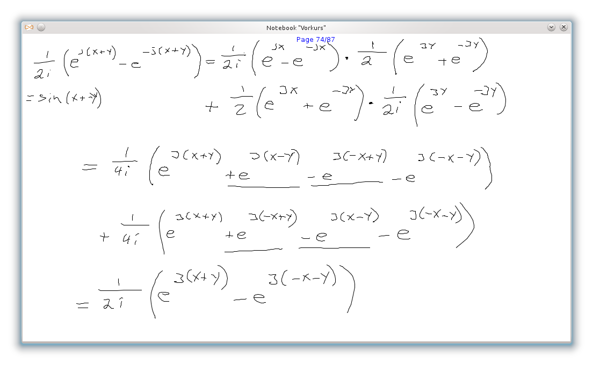
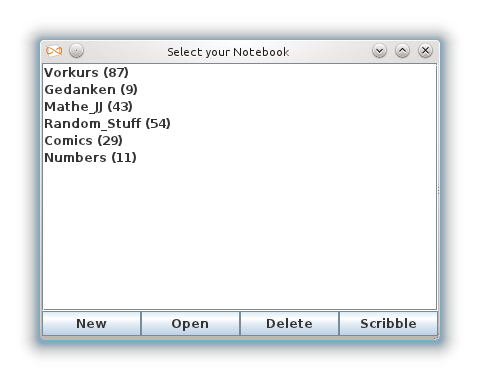

#########
jscribble
#########

    The jscribble logo.

When doing a derivation in math or just organizing my thoughts, I usually just
use pen and paper since it seems to be the fastest way to persist my thoughts.
Typing on a computer is great for great amounts of text, but making diagrams
is not that easy I think.

Since most of the paper that I write is not read after a day or so, I tried to
come up with a better way. Text on the computer can be easily deleted if you
do not need it any more, but you cannot erase pen from paper too easily.

My idea is that your computer can easily serve as an almost infinite notebook.
If you save pictures with the resolution of your screen, you can store
millions of pages. And they do not weigh anything. Ideally, you do not need to
bring paper to do your math homework, following a lecture or sketch something.

Since you cannot seriously draw with a mouse, you need to have something like
a pen tablet or a touch screen to make this work well.

You might say that using a graphics tablet is nothing new. Sure, there is
plenty of drawing software out there. But I just did not find one where you
cannot click on anything that makes your page disappear and can create a
reasonable number of images (i.e. pages) with little effort.

.. note::

    After jscribble worked pretty well, I discovered Xournal_, which offers a
    lot more features than this program. On a small screen however, the problem
    is that Xournal_ is paper and not screen page oriented. Also, you cannot
    hide the toolbar which might become a problem if somebody clicks onto it
    accidentally.

    It runs on GNU/Linux very well. There is a Windows Installer, but I have
    not tried that.

So my software goes full screen on small screens and into a window on large
screens. You can set the standard resolution in a configuration file. You can
only control it with your keyboard. That way, you can draw freely with your
pen without worrying about accidentally clicking something.

    jscribble in a window with some Math

If you have filled the whole screen, just press the arrow keys (or space bar
or enter) to advance in your virtual sheet. If you are at the end of it, at
new page is instantly created. That way, you will never run out of (virtual)
paper.

You can organize your notesheets in notebooks that can individually hold as
many pages as you like. On startup you can choose the notebook that you want
to work in:

    the notebook selection window at startup

The notebooks are saved in a hidden directory such that one does not have to
worry about the files on disk. You can still get to the individual images,
though, as described in the manual.

If you just need paper for scribbling, you can just enter the *scribble* mode.
You can go back and forth in this, but when you close it, it disposes all the
sheets.

Project Pages at:

- GitHub_
- Launchpad_
- Ohloh_

Download
========

You will probably want the regular ``.jar`` which will run if you have Java
installed on your computer. Just launch the ``jscribble-X.jar`` with a double
click or with ``java -jar jscribble-X.jar`` in the command line.

`<jscribble.jar>`_

If you use Debian or Arch Linux, you can use the package.

Packages
========

This program is featured in Debian Sid_ and Wheezy_ as well as Arch_ Linux so
far.
Building from source
====================

Just the program
----------------

You can obtain a tarball with the latest source code from the `jscribble
website <http://martin-ueding.de/en/projects/jscribble/#pk_campaign=git>`_.

The following software is needed to compile this program:

make
    Build system.
Java Development Kit
    Java compiler, version 1.6 works.
xgettext, msgfmt
    Parses source code for translation calls and converts translation file into
    the Java property format.
php5-cli
    Used for various file creations, lists all the config entries in the manual
    page for instance.
rst2man
    Converts reStructuredText into html and manual page.
various Linux tools
    find, rm, touch, bash

To build the main program, simply invoke make:

.. code:: console

	$ make

Then you can just launch the program with a ``java -jar jscribble.jar``. In case
you use Linux and want to install it for all users, run this:

.. code:: console

	# make install

Now it can be launched with a simple ``jscribble``.

Developer documentation
-----------------------

In case you want to build all the developer documentation, you might want to
install these as well:

javadoc
    A HTML documentation generator for Java. This should be included with the
    Java Development Kit (JDK).

To build the documentation, call:

.. code:: console

	$ build dev-doc

Unit tests
----------

jscribble has a couple test cases which can be run with junit.

junit
    Unit test runner for Java.

To run the tests, call:

.. code:: console

    $ make test

Contributing
============

If you like, you can send patches from the latest source checkout. Please
include which version you based on, so that I can merge. If you care for the
git repository, please let me know.

.. _Arch: https://aur.archlinux.org/packages.php?ID=51337
.. _GitHub: https://github.com/martin-ueding/jscribble
.. _Launchpad: https://launchpad.net/jscribble
.. _Ohloh: https://www.ohloh.net/p/jscribble
.. _Sid: http://packages.debian.org/sid/jscribble
.. _Wheezy: http://packages.debian.org/wheezy/jscribble
.. _Xournal: http://xournal.sourceforge.net/

